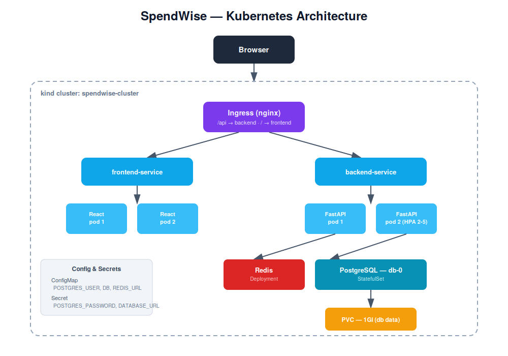
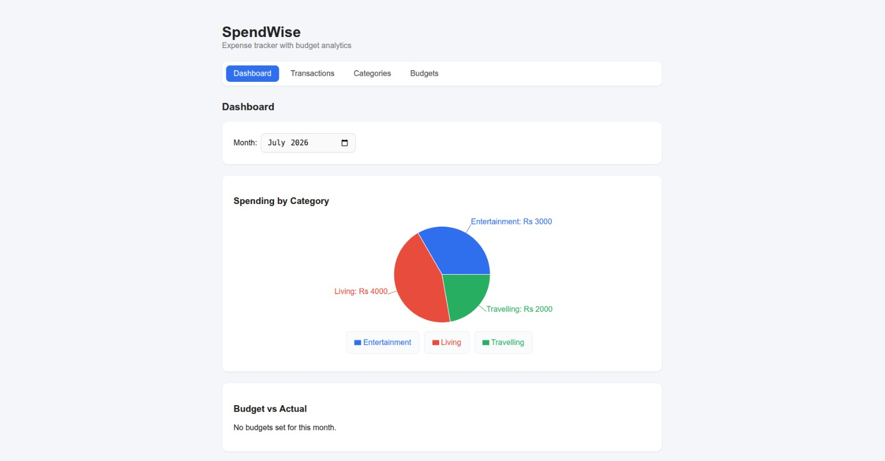
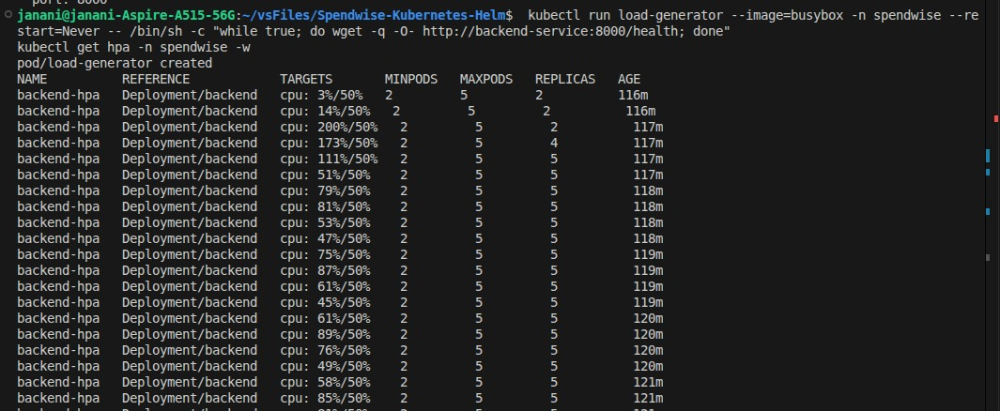
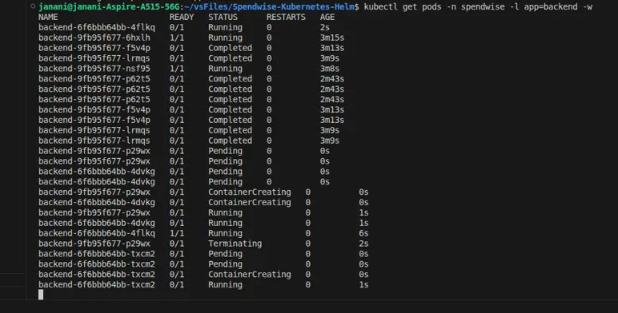
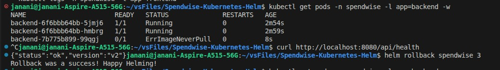

# 🚀 SpendWise on Kubernetes + Helm

> Migrating a production-style multi-service app from Docker Compose to a fully orchestrated Kubernetes deployment — with Helm packaging, autoscaling, self-healing, and zero-downtime rollouts.

This project takes [SpendWise](https://github.com/JananiUpeksha/Spendwise-Terraform) — an expense tracker built with FastAPI, PostgreSQL, Redis, and React — and re-platforms it onto Kubernetes, packaged as a Helm chart, with production-grade resilience patterns proven out on a local `kind` cluster.

---

## 📐 Architecture

**Before (Docker Compose on EC2):**
A single EC2 instance running all containers side-by-side, connected via a Compose bridge network, with a standalone Nginx container handling reverse proxy routing.

**After (Kubernetes + Helm):**
A 3-node `kind` cluster (1 control-plane + 2 workers), with every service running as a proper Kubernetes object — Deployments, a StatefulSet, Services, an Ingress controller — all packaged and deployed as a single Helm chart.



---

## 🧰 Tech Stack

| Layer | Technology |
|---|---|
| Backend | FastAPI, SQLAlchemy, Alembic |
| Database | PostgreSQL 16 (StatefulSet + PVC) |
| Cache | Redis 7 |
| Frontend | React + Vite, served via Nginx |
| Orchestration | Kubernetes (kind) |
| Packaging | Helm 3 |
| Ingress | ingress-nginx |
| Autoscaling | Horizontal Pod Autoscaler (HPA) + metrics-server |

---

## ✨ What This Project Demonstrates

- ✅ Migrated a multi-service Docker Compose app to Kubernetes with zero functionality loss
- ✅ Packaged the entire stack as a **reusable Helm chart** — one command deploys everything
- ✅ Configured **StatefulSet + PVC** for PostgreSQL to preserve data across pod restarts
- ✅ Implemented **liveness/readiness probes** for self-healing and safe rollouts
- ✅ Set up **Ingress routing** replicating the original Nginx reverse-proxy rules
- ✅ Built a **HorizontalPodAutoscaler** — verified scaling 2→5 replicas under real CPU load
- ✅ Proved **self-healing**: manually killed a pod, Kubernetes replaced it automatically
- ✅ Performed a **zero-downtime rolling update** with a live traffic test
- ✅ Simulated a **broken deployment** and recovered instantly with `helm rollback`

---

## 📁 Repository Structure

```
├── backend/                 # FastAPI application
├── frontend/                # React application
├── k8s/                     # Raw K8s manifests (Phases 1-6, kept for reference)
├── spendwise-chart/         # Helm chart (Phase 7 onward — the main deliverable)
│   ├── Chart.yaml
│   ├── values.yaml
│   └── templates/
├── terraform/                # IaC for optional EC2/EKS deployment (from original repo)
└── img/                       # Screenshots and diagrams for this README
```

---

## 🏁 Getting Started

### Prerequisites
```bash
# kubectl, kind, and Helm must be installed
kubectl version --client
kind version
helm version
```

### 1. Create the cluster
```bash
kind create cluster --config k8s/kind-config.yaml
```

### 2. Build and load the app images
```bash
docker build -t spendwise-backend:v2 ./backend
docker build -t spendwise-frontend:v1 ./frontend
kind load docker-image spendwise-backend:v2 --name spendwise-cluster
kind load docker-image spendwise-frontend:v1 --name spendwise-cluster
```

### 3. Install the Ingress controller
```bash
kubectl apply -f https://raw.githubusercontent.com/kubernetes/ingress-nginx/main/deploy/static/provider/kind/deploy.yaml
kubectl wait --namespace ingress-nginx --for=condition=ready pod --selector=app.kubernetes.io/component=controller --timeout=90s
```

### 4. Deploy SpendWise with Helm
```bash
helm install spendwise spendwise-chart
```

### 5. Run database migrations
```bash
kubectl exec -it -n spendwise deploy/backend -- alembic upgrade head
```

### 6. Access the app
```bash
kubectl port-forward -n ingress-nginx svc/ingress-nginx-controller 8080:80
```
Visit **http://localhost:8080**



---

## 📊 Autoscaling in Action

The backend scales automatically between **2 and 5 replicas** based on CPU utilization (target: 50%).

Generated sustained load with a busybox pod hammering `/health`, then watched `kubectl get hpa -n spendwise -w`:

| CPU | Replicas |
|---|---|
| 3% | 2 |
| 111% | 4 |
| 173% | 5 |

Once load stopped, replicas scaled back down to the baseline of 2 after the stabilization window passed.



---

## 🔄 Zero-Downtime Rolling Updates

Bumped the backend image and triggered a rolling update via `helm upgrade`. Kubernetes created new pods, waited for them to pass readiness checks, and **only then** terminated the old pods — old and new ReplicaSets briefly coexisted, with no dropped requests.

```bash
curl http://localhost:8080/api/health
# {"status":"ok","version":"v2"}
```



---

## ⏪ Rollback Recovery

Simulated a bad deploy by pointing the backend at a nonexistent image tag. The broken pod failed immediately (`ErrImageNeverPull`) — but because Kubernetes never terminates healthy pods until replacements are ready, **the app kept serving traffic throughout**. Recovered in one command:

```bash
helm rollback spendwise 3
```



---

## 🩺 Self-Healing

Manually deleted a running backend pod. Kubernetes' Deployment controller detected the mismatch between desired (2 replicas) and actual (1) state, and created a replacement automatically within seconds — no manual intervention.

```bash
kubectl delete pod backend-66c6b96847-jrthc -n spendwise
# New pod backend-66c6b96847-fh894 created automatically
```

---

## 🗺️ Helm Chart Overview

```bash
helm lint spendwise-chart                  # Validate chart structure
helm template spendwise-chart              # Render manifests locally (dry run)
helm install spendwise spendwise-chart     # Deploy
helm upgrade spendwise spendwise-chart     # Apply changes
helm rollback spendwise <revision>         # Revert to a previous revision
helm uninstall spendwise                   # Tear down
```

All configuration (image tags, replica counts, resource limits, HPA thresholds) is centralized in [`values.yaml`](spendwise-chart/values.yaml) — no need to touch template files to reconfigure the deployment.

---

## 🔮 Roadmap

- [ ] Add Prometheus + Grafana + cAdvisor observability stack
- [ ] Deploy to a managed cluster (EKS) using the existing Terraform config
- [ ] Add CI pipeline running `helm lint` + `helm template` validation on every PR

---

## 📚 Related Projects

- [SpendWise (Docker Compose + Terraform + EC2)](https://github.com/JananiUpeksha/Spendwise-Terraform) — the original deployment this project migrated from
